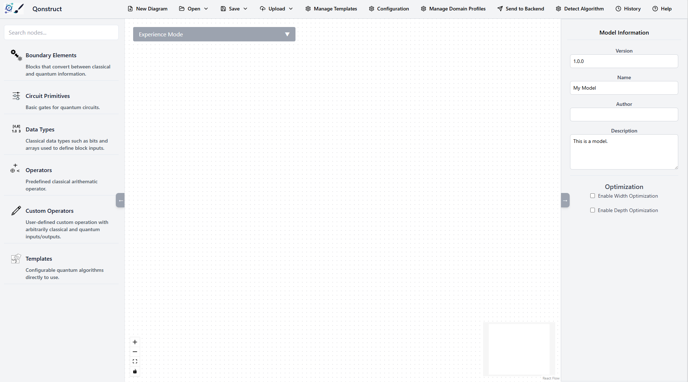
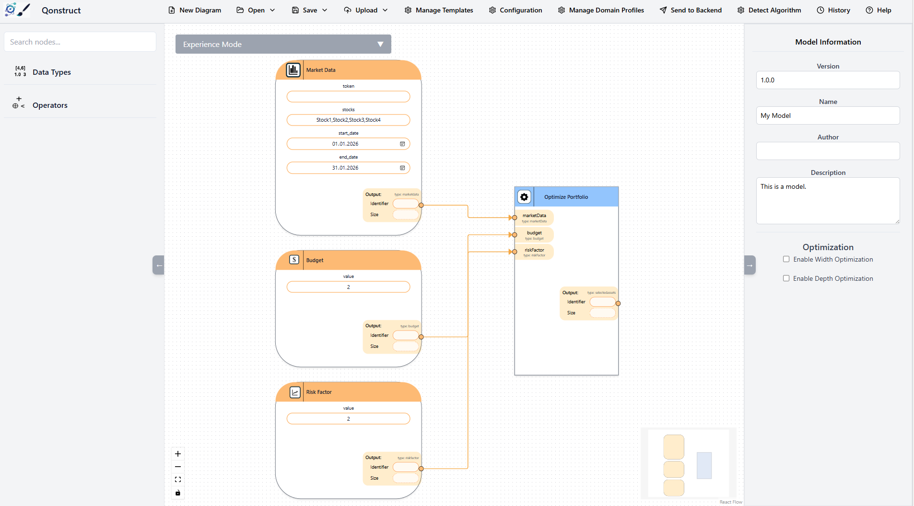
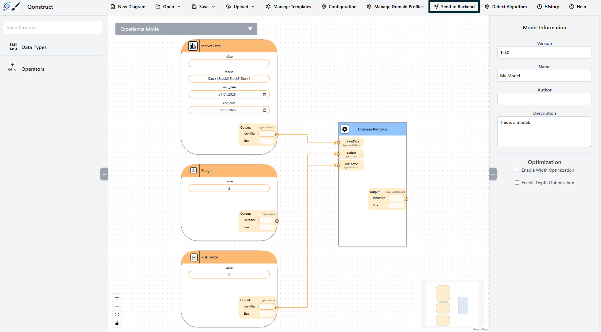
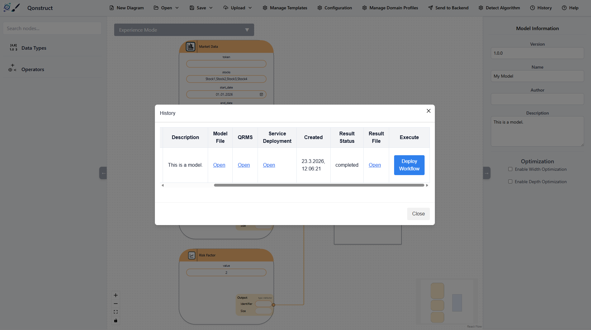

# QUANCOM 2026

This repository accompanies the QUANCOM 2026 demo paper and provides a research prototype of the **Qonstruct: A Collaborative Low-Code Platform for Quantum Application Design and Execution** together with a complete execution environment for collaborative design of quantum low-code models.

The artifact demonstrates how quantum experts and beginners model quantum applications collaboratively to increase the number of available models but also to laern each others vocabulary.

---

## Overview

The system consists of the following components:

- **Quantum Low-Code Modeler**  
  A web-based graphical modeling environment that enables the collaborative design of quantum applications. It provides visual elements to specify problems at a high level of abstraction instead of quantum circuits.

- **Backend Transformation Service**  
  A service that automatically transforms the low-code models into executable quantum circuits.

- **Qunicorn**
Middleware for the execution of quantum circuits on different quantum cloud providers.

---

## 1. Start the Quantum Low-Code Modeler

Run the following commands to start the Quantum Low-Code Modeler:

```
git clone https://github.com/AnonymousUserAccount958/low-code-modeler.git
npm run dev
```
---

## 2. Start the Quantum Low-Code Backend

Run the following commands to start the Quantum Low-Code Backend:

```
git clone https://github.com/AnonymousUserAccount958/leqo-backend.git
npm run dev
```

---

## 3. Start Qunicorn

Run the following commands to start tQunicorn

```
git clone https://github.com/qunicorn/qunicorn-core.git
docker-compose up
```

---


## 4. Open the Quantum Low-Code Modeler

Open the Quantum Low-Code Modeler at http://localhost:4242.

You should see the Modeler start screen:



---

## 5. Open a second tab of the Quantum Low-Code Modeler

Open a second tab of the Quantum Low-Code Modeler at http://localhost:4242.

You should see the Modeler start screen:


---

## 6. Start the collaborative mode in both modeler

Click on "Experience Mode" and enable "Collaborative Mode"

---


## 7. Import the Model

Import the .

After loading, the model should resemble the example shown below.


---

## 8. Transform the Model

Click "Send to Backend" to transform the domain model into an executable circuit.


---

## 9. Transform the Model

Click "History" and click on "Execute Circuit". Then select every blue button and you should see the execution result.


---


## Disclaimer of Warranty
Unless required by applicable law or agreed to in writing, Licensor provides the Work (and each Contributor provides its Contributions) on an "AS IS" BASIS, WITHOUT WARRANTIES OR CONDITIONS OF ANY KIND, either express or implied, including, without limitation, any warranties or conditions of TITLE, NON-INFRINGEMENT, MERCHANTABILITY, or FITNESS FOR A PARTICULAR PURPOSE. You are solely responsible for determining the appropriateness of using or redistributing the Work and assume any risks associated with Your exercise of permissions under this License.

## Haftungsausschluss
Dies ist ein Forschungsprototyp. Die Haftung für entgangenen Gewinn, Produktionsausfall, Betriebsunterbrechung, entgangene Nutzungen, Verlust von Daten und Informationen, Finanzierungsaufwendungen sowie sonstige Vermögens- und Folgeschäden ist, außer in Fällen von grober Fahrlässigkeit, Vorsatz und Personenschäden, ausgeschlossen.
